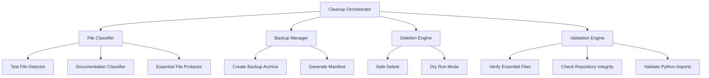
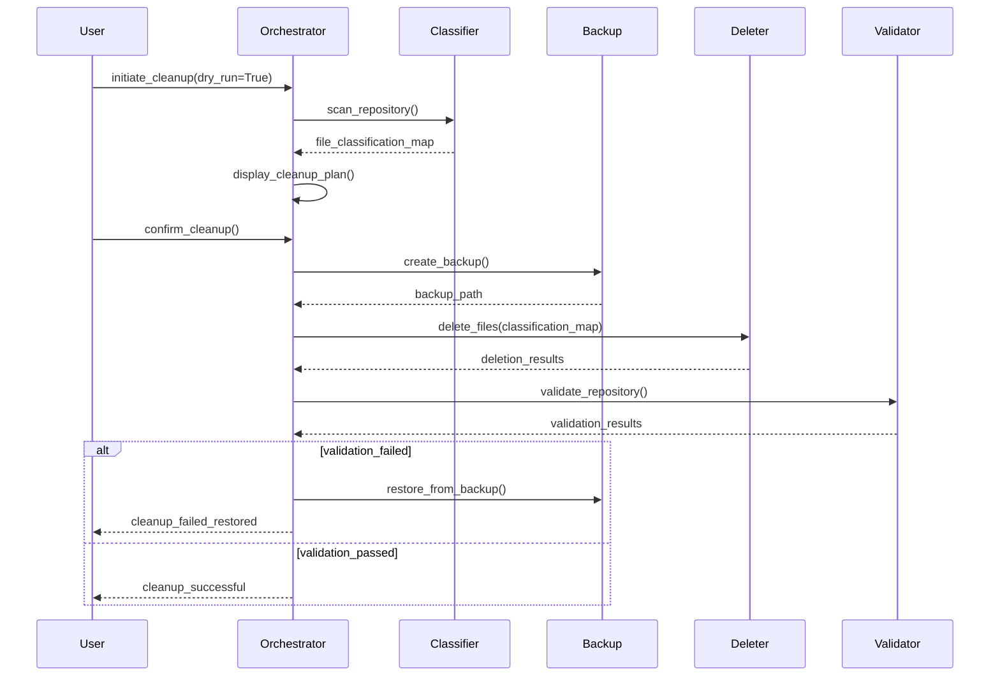

# Design Document: Repository Cleanup

## Overview

This feature implements a systematic cleanup of the REAG fraud investigation repository to remove test files and intermediate documentation while preserving essential code, notebooks, scripts, and core documentation. The cleanup will improve repository maintainability, reduce cognitive load for developers, and establish a clear structure for future development. The design follows a safe, reversible approach with backup creation and validation steps to ensure no critical files are accidentally removed.

## Architecture



## Main Algorithm/Workflow



## Components and Interfaces

### Component 1: File Classifier

**Purpose**: Analyzes repository files and categorizes them into essential, removable test files, and removable documentation.

**Interface**:
```python
class FileClassifier:
    def scan_repository(self, root_path: Path) -> FileClassificationMap
    def is_test_file(self, file_path: Path) -> bool
    def is_intermediate_doc(self, file_path: Path) -> bool
    def is_essential_file(self, file_path: Path) -> bool
    def get_classification_report(self) -> ClassificationReport
```

**Responsibilities**:
- Scan repository directory structure
- Identify test files by naming patterns and location
- Classify documentation as essential or intermediate
- Protect essential files from deletion
- Generate human-readable classification report

### Component 2: Backup Manager

**Purpose**: Creates timestamped backups of files before deletion to enable recovery if needed.

**Interface**:
```python
class BackupManager:
    def create_backup(self, files: List[Path], backup_dir: Path) -> BackupResult
    def generate_manifest(self, files: List[Path]) -> Manifest
    def restore_from_backup(self, backup_path: Path) -> RestoreResult
    def list_backups(self) -> List[BackupInfo]
```

**Responsibilities**:
- Create compressed archive of files to be deleted
- Generate manifest with file metadata (size, hash, timestamp)
- Provide restore functionality
- Manage backup retention and cleanup

### Component 3: Deletion Engine

**Purpose**: Safely removes classified files with dry-run support and atomic operations.

**Interface**:
```python
class DeletionEngine:
    def delete_files(self, files: List[Path], dry_run: bool = False) -> DeletionResult
    def delete_directory(self, dir_path: Path, dry_run: bool = False) -> DeletionResult
    def rollback_deletion(self, deletion_id: str) -> RollbackResult
```

**Responsibilities**:
- Execute file deletions with error handling
- Support dry-run mode for preview
- Track deletion operations for rollback
- Remove empty directories after file deletion

### Component 4: Validation Engine

**Purpose**: Verifies repository integrity after cleanup to ensure no essential functionality is broken.

**Interface**:
```python
class ValidationEngine:
    def validate_repository(self) -> ValidationResult
    def check_essential_files_exist(self) -> bool
    def validate_python_imports(self) -> ImportValidationResult
    def check_git_status(self) -> GitStatusResult
```

**Responsibilities**:
- Verify all essential files are present
- Test Python imports for src/ modules
- Check git repository status
- Generate validation report with any issues

### Component 5: Cleanup Orchestrator

**Purpose**: Coordinates the entire cleanup workflow and provides user interface.

**Interface**:
```python
class CleanupOrchestrator:
    def initiate_cleanup(self, dry_run: bool = True) -> CleanupPlan
    def execute_cleanup(self, plan: CleanupPlan) -> CleanupResult
    def display_plan(self, plan: CleanupPlan) -> None
    def get_cleanup_summary(self) -> CleanupSummary
```

**Responsibilities**:
- Orchestrate workflow steps in correct order
- Provide user-friendly output and progress updates
- Handle errors and coordinate rollback
- Generate final cleanup summary

## Data Models

### FileClassificationMap

```python
class FileClassification(Enum):
    ESSENTIAL = "essential"
    TEST_FILE = "test_file"
    INTERMEDIATE_DOC = "intermediate_doc"
    LEGACY_DOC = "legacy_doc"
    UNKNOWN = "unknown"

class FileClassificationMap(TypedDict):
    essential: List[Path]
    test_files: List[Path]
    intermediate_docs: List[Path]
    legacy_docs: List[Path]
    unknown: List[Path]
```

**Validation Rules**:
- All paths must be relative to repository root
- No file can appear in multiple categories
- Essential files list must include minimum required files

### CleanupPlan

```python
class CleanupPlan(TypedDict):
    files_to_delete: List[Path]
    files_to_keep: List[Path]
    backup_location: Path
    estimated_space_freed: int
    dry_run: bool
    timestamp: datetime
```

**Validation Rules**:
- files_to_delete and files_to_keep must be disjoint sets
- backup_location must be writable
- estimated_space_freed must be non-negative

### CleanupResult

```python
class CleanupResult(TypedDict):
    success: bool
    files_deleted: List[Path]
    files_failed: List[Tuple[Path, str]]
    backup_path: Optional[Path]
    space_freed: int
    validation_passed: bool
    errors: List[str]
```

**Validation Rules**:
- If success is True, validation_passed must be True
- files_deleted count must match plan unless errors occurred
- backup_path must exist if any files were deleted

## Key Functions with Formal Specifications

### Function 1: scan_repository()

```python
def scan_repository(root_path: Path) -> FileClassificationMap
```

**Preconditions:**
- `root_path` exists and is a directory
- `root_path` is a valid git repository
- Process has read permissions for all files in repository

**Postconditions:**
- Returns FileClassificationMap with all repository files classified
- Every file in repository appears in exactly one classification category
- Essential files list includes at minimum: README.md, USER_GUIDE.md, AGENTS.md, docs/ARCHITECTURE.md, src/**, notebooks/**, scripts/**
- No file path appears in multiple categories

**Loop Invariants:** 
- During directory traversal: All processed files are classified into exactly one category
- Classification map remains valid (no duplicates) throughout scan

### Function 2: create_backup()

```python
def create_backup(files: List[Path], backup_dir: Path) -> BackupResult
```

**Preconditions:**
- `files` is non-empty list of existing file paths
- `backup_dir` exists and is writable
- Sufficient disk space available for backup archive

**Postconditions:**
- Returns BackupResult with success=True and valid backup_path
- Backup archive exists at backup_path
- Backup archive contains all files from input list
- Manifest file created alongside archive with file metadata
- Original files remain unchanged

**Loop Invariants:**
- For each file being backed up: All previously archived files are intact in archive
- Archive integrity maintained throughout backup process

### Function 3: delete_files()

```python
def delete_files(files: List[Path], dry_run: bool = False) -> DeletionResult
```

**Preconditions:**
- `files` is a list of file paths (may be empty)
- If dry_run=False, backup has been created
- No file in `files` is classified as essential

**Postconditions:**
- If dry_run=True: No files are deleted, returns preview of what would be deleted
- If dry_run=False: All files in list are deleted or error recorded
- Returns DeletionResult with list of successfully deleted files and failures
- Empty parent directories are removed after file deletion
- Git working directory reflects deletions

**Loop Invariants:**
- During deletion: All previously deleted files no longer exist on filesystem
- Deletion tracking remains consistent (no lost records)

### Function 4: validate_repository()

```python
def validate_repository() -> ValidationResult
```

**Preconditions:**
- Repository cleanup has been executed
- Repository root path is accessible

**Postconditions:**
- Returns ValidationResult indicating repository health
- Checks all essential files exist
- Verifies Python imports for src/ modules work
- Confirms git repository is in clean state (no corruption)
- If validation fails, provides specific error messages

**Loop Invariants:**
- During validation checks: All previous validation results remain valid
- Validation state is consistent throughout all checks

## Algorithmic Pseudocode

### Main Cleanup Algorithm

```pascal
ALGORITHM executeCleanup(dryRun: boolean)
INPUT: dryRun - whether to preview changes without executing
OUTPUT: result of type CleanupResult

BEGIN
  ASSERT repository_exists() AND has_git_directory()
  
  // Step 1: Scan and classify files
  PRINT "Scanning repository..."
  classificationMap ← scanRepository(REPO_ROOT)
  
  // Step 2: Build cleanup plan
  plan ← buildCleanupPlan(classificationMap, dryRun)
  PRINT "Files to delete:", LENGTH(plan.files_to_delete)
  PRINT "Space to free:", formatBytes(plan.estimated_space_freed)
  
  // Step 3: Display plan and get confirmation
  displayCleanupPlan(plan)
  
  IF dryRun THEN
    RETURN CleanupResult(success: true, dry_run: true, plan: plan)
  END IF
  
  IF NOT getUserConfirmation() THEN
    RETURN CleanupResult(success: false, cancelled: true)
  END IF
  
  // Step 4: Create backup
  PRINT "Creating backup..."
  backupResult ← createBackup(plan.files_to_delete, BACKUP_DIR)
  
  IF NOT backupResult.success THEN
    RETURN CleanupResult(success: false, error: "Backup failed")
  END IF
  
  // Step 5: Execute deletions
  PRINT "Deleting files..."
  deletionResult ← deleteFiles(plan.files_to_delete, dryRun: false)
  
  // Step 6: Validate repository integrity
  PRINT "Validating repository..."
  validationResult ← validateRepository()
  
  IF NOT validationResult.passed THEN
    PRINT "Validation failed, restoring from backup..."
    restoreFromBackup(backupResult.backup_path)
    RETURN CleanupResult(success: false, error: "Validation failed, restored")
  END IF
  
  // Step 7: Generate summary
  summary ← generateCleanupSummary(deletionResult, validationResult)
  PRINT summary
  
  RETURN CleanupResult(
    success: true,
    files_deleted: deletionResult.deleted,
    backup_path: backupResult.backup_path,
    space_freed: deletionResult.space_freed,
    validation_passed: true
  )
END
```

**Preconditions:**
- Repository is a valid git repository
- User has write permissions
- Python environment is activated

**Postconditions:**
- If successful: Test files and intermediate docs are deleted, backup created, validation passed
- If failed: Repository restored to original state
- Cleanup summary generated and displayed

**Loop Invariants:**
- Repository remains in valid state throughout execution
- Backup exists before any deletions occur

### File Classification Algorithm

```pascal
ALGORITHM scanRepository(rootPath: Path)
INPUT: rootPath - repository root directory
OUTPUT: classificationMap of type FileClassificationMap

BEGIN
  classificationMap ← {
    essential: [],
    test_files: [],
    intermediate_docs: [],
    legacy_docs: [],
    unknown: []
  }
  
  // Define essential patterns
  essentialPatterns ← [
    "README.md",
    "USER_GUIDE.md", 
    "AGENTS.md",
    "docs/ARCHITECTURE.md",
    "src/**",
    "notebooks/**",
    "scripts/**",
    "requirements.txt",
    "pyproject.toml",
    ".gitignore",
    "config/**"
  ]
  
  // Define test file patterns
  testPatterns ← [
    "test_*.py",
    "*_test.py",
    "run_test.py",
    "run_error_tests.py",
    "verify_*.py"
  ]
  
  // Define intermediate doc patterns
  intermediateDocPatterns ← [
    "*_SUMMARY.md",
    "*_IMPROVEMENTS.md",
    "*_COMPLETE.md",
    "*_RESULTS.md",
    "IMPLEMENTATION_PLAN.md",
    "IMPROVEMENT_RECOMMENDATIONS.md"
  ]
  
  // Traverse repository
  FOR each file IN walkDirectory(rootPath) DO
    ASSERT file NOT IN any_classification_category
    
    relativePath ← file.relative_to(rootPath)
    
    // Check essential first (highest priority)
    IF matchesAnyPattern(relativePath, essentialPatterns) THEN
      classificationMap.essential.append(relativePath)
      CONTINUE
    END IF
    
    // Check legacy docs
    IF relativePath.startsWith("docs/legacy/") THEN
      classificationMap.legacy_docs.append(relativePath)
      CONTINUE
    END IF
    
    // Check test files
    IF matchesAnyPattern(relativePath, testPatterns) THEN
      classificationMap.test_files.append(relativePath)
      CONTINUE
    END IF
    
    // Check intermediate docs
    IF matchesAnyPattern(relativePath, intermediateDocPatterns) THEN
      classificationMap.intermediate_docs.append(relativePath)
      CONTINUE
    END IF
    
    // Unknown files - require manual review
    classificationMap.unknown.append(relativePath)
  END FOR
  
  ASSERT all_files_classified_once(classificationMap)
  ASSERT essential_files_present(classificationMap.essential)
  
  RETURN classificationMap
END
```

**Preconditions:**
- rootPath exists and is readable
- rootPath contains a git repository

**Postconditions:**
- All files in repository are classified into exactly one category
- Essential files include minimum required set
- No file appears in multiple categories

**Loop Invariants:**
- Each file is classified into exactly one category
- Classification map remains valid (no duplicates) throughout iteration

### Backup Creation Algorithm

```pascal
ALGORITHM createBackup(files: List[Path], backupDir: Path)
INPUT: files - list of files to backup, backupDir - backup destination
OUTPUT: backupResult of type BackupResult

BEGIN
  ASSERT LENGTH(files) > 0
  ASSERT backupDir.exists() AND backupDir.is_writable()
  
  // Generate backup metadata
  timestamp ← getCurrentTimestamp()
  backupName ← "cleanup_backup_" + timestamp + ".tar.gz"
  backupPath ← backupDir / backupName
  manifestPath ← backupDir / ("manifest_" + timestamp + ".json")
  
  // Create manifest
  manifest ← {
    timestamp: timestamp,
    files: [],
    total_size: 0
  }
  
  FOR each file IN files DO
    ASSERT file.exists()
    
    fileInfo ← {
      path: file.as_string(),
      size: file.size(),
      hash: computeSHA256(file),
      modified: file.modified_time()
    }
    
    manifest.files.append(fileInfo)
    manifest.total_size ← manifest.total_size + file.size()
  END FOR
  
  // Write manifest
  writeJSON(manifestPath, manifest)
  
  // Create compressed archive
  archive ← createTarGz(backupPath)
  
  FOR each file IN files DO
    archive.add(file, arcname: file.relative_to(REPO_ROOT))
  END FOR
  
  archive.close()
  
  ASSERT backupPath.exists()
  ASSERT manifestPath.exists()
  
  RETURN BackupResult(
    success: true,
    backup_path: backupPath,
    manifest_path: manifestPath,
    files_backed_up: LENGTH(files),
    backup_size: backupPath.size()
  )
END
```

**Preconditions:**
- files list is non-empty
- All files in list exist and are readable
- backupDir exists and is writable
- Sufficient disk space for backup

**Postconditions:**
- Backup archive created at backupPath
- Manifest file created with metadata
- All input files included in archive
- Original files unchanged

**Loop Invariants:**
- All previously processed files are in archive
- Manifest remains consistent with archived files

### Validation Algorithm

```pascal
ALGORITHM validateRepository()
INPUT: none (operates on current repository state)
OUTPUT: validationResult of type ValidationResult

BEGIN
  validationResult ← {
    passed: true,
    checks: [],
    errors: []
  }
  
  // Check 1: Essential files exist
  essentialFiles ← [
    "README.md",
    "USER_GUIDE.md",
    "AGENTS.md",
    "docs/ARCHITECTURE.md",
    "src/__init__.py",
    "requirements.txt"
  ]
  
  FOR each file IN essentialFiles DO
    IF NOT file.exists() THEN
      validationResult.passed ← false
      validationResult.errors.append("Missing essential file: " + file)
    ELSE
      validationResult.checks.append("✓ " + file + " exists")
    END IF
  END FOR
  
  // Check 2: Essential directories exist
  essentialDirs ← ["src", "notebooks", "scripts", "config"]
  
  FOR each dir IN essentialDirs DO
    IF NOT dir.exists() OR NOT dir.is_directory() THEN
      validationResult.passed ← false
      validationResult.errors.append("Missing essential directory: " + dir)
    ELSE
      validationResult.checks.append("✓ " + dir + "/ exists")
    END IF
  END FOR
  
  // Check 3: Python imports work
  importResult ← validatePythonImports()
  
  IF NOT importResult.success THEN
    validationResult.passed ← false
    validationResult.errors.append("Python import validation failed")
    validationResult.errors.extend(importResult.errors)
  ELSE
    validationResult.checks.append("✓ Python imports valid")
  END IF
  
  // Check 4: Git repository integrity
  gitStatus ← checkGitStatus()
  
  IF gitStatus.corrupted THEN
    validationResult.passed ← false
    validationResult.errors.append("Git repository corrupted")
  ELSE
    validationResult.checks.append("✓ Git repository intact")
  END IF
  
  RETURN validationResult
END
```

**Preconditions:**
- Repository exists
- Python environment is activated

**Postconditions:**
- Returns validation result with pass/fail status
- If failed, provides specific error messages
- All essential files and directories checked

**Loop Invariants:**
- Validation state remains consistent
- All previous checks remain valid

## Example Usage

```python
# Example 1: Dry run to preview cleanup
from src.cleanup import CleanupOrchestrator

orchestrator = CleanupOrchestrator(repo_root=".")
plan = orchestrator.initiate_cleanup(dry_run=True)

print(f"Files to delete: {len(plan.files_to_delete)}")
print(f"Space to free: {plan.estimated_space_freed / 1024 / 1024:.2f} MB")

# Example 2: Execute cleanup with confirmation
result = orchestrator.execute_cleanup(plan)

if result.success:
    print(f"✓ Cleanup successful!")
    print(f"  Deleted: {len(result.files_deleted)} files")
    print(f"  Freed: {result.space_freed / 1024 / 1024:.2f} MB")
    print(f"  Backup: {result.backup_path}")
else:
    print(f"✗ Cleanup failed: {result.errors}")

# Example 3: Restore from backup if needed
from src.cleanup import BackupManager

backup_mgr = BackupManager()
backups = backup_mgr.list_backups()
latest_backup = backups[0]

restore_result = backup_mgr.restore_from_backup(latest_backup.path)
if restore_result.success:
    print("✓ Repository restored from backup")
```

## Correctness Properties

*A property is a characteristic or behavior that should hold true across all valid executions of a system—essentially, a formal statement about what the system should do. Properties serve as the bridge between human-readable specifications and machine-verifiable correctness guarantees.*

### Property 1: Atomic File Classification

*For any* repository scan operation, every file in the repository must be classified into exactly one category (essential, test_file, intermediate_doc, legacy_doc, or unknown), with no file appearing in multiple categories.

**Validates: Requirements 1.1, 1.6**

### Property 2: Pattern-Based Classification Correctness

*For any* file path, if it matches a test file pattern (test_*.py, *_test.py, run_test.py, etc.), it must be classified as a test file; if it matches an intermediate doc pattern (*_SUMMARY.md, *_IMPROVEMENTS.md, etc.), it must be classified as intermediate documentation; if it matches an essential file pattern (README.md, src/**, notebooks/**, etc.), it must be classified as essential.

**Validates: Requirements 1.2, 1.3, 1.4, 1.5**

### Property 3: Essential Files Never Deleted

*For any* cleanup operation, all files classified as essential must still exist after the operation completes, regardless of success or failure.

**Validates: Requirements 1.4, 4.5, 5.1, 5.2**

### Property 4: Dry-Run Has No Side Effects

*For any* cleanup operation with dry_run=True, no files shall be deleted, no directories shall be removed, and the repository state shall remain unchanged, while still producing a complete cleanup plan.

**Validates: Requirements 2.3, 2.4, 4.6**

### Property 5: Cleanup Plan Accuracy

*For any* cleanup plan, the estimated disk space to be freed must equal the sum of file sizes for all files marked for deletion, and the plan must group files by their classification categories.

**Validates: Requirements 2.1, 2.2, 2.5**

### Property 6: Backup Before Deletion

*For any* cleanup operation with dry_run=False, a backup archive must be successfully created and verified before any files are deleted, and only files included in the backup may be deleted.

**Validates: Requirements 3.1, 3.5, 4.1**

### Property 7: Backup Completeness and Integrity

*For any* backup operation, the backup archive must contain all files marked for deletion, the manifest must include metadata (path, size, SHA256 hash, modification time) for each file, and the backup filename must follow the format cleanup_backup_TIMESTAMP.tar.gz.

**Validates: Requirements 3.2, 3.3, 3.4, 3.6, 3.7**

### Property 8: Deletion Resilience

*For any* deletion operation, if one file fails to delete, the operation must continue with remaining files, track all successes and failures with error messages, and report the actual disk space freed based on successfully deleted files.

**Validates: Requirements 4.2, 4.3, 4.7**

### Property 9: Empty Directory Cleanup

*For any* file deletion that results in an empty parent directory, that directory must be removed after the file is deleted.

**Validates: Requirements 4.4**

### Property 10: Validation Before Success

*For any* cleanup operation, the operation can only be marked as successful if all validation checks pass, including essential file existence, essential directory existence, Python import validation, and git repository integrity.

**Validates: Requirements 5.1, 5.2, 5.3, 5.4, 5.7**

### Property 11: Validation Error Reporting

*For any* validation operation, if any check fails, the validation result must include specific error messages indicating which checks failed and a complete report of all checks performed with their pass/fail status.

**Validates: Requirements 5.5, 5.6**

### Property 12: Automatic Rollback on Validation Failure

*For any* cleanup operation where validation fails after deletion, the system must automatically restore all files from the backup archive to their original locations, verify the repository has returned to its pre-cleanup state, and preserve the backup archive for future reference.

**Validates: Requirements 6.1, 6.2, 6.3, 6.5**

### Property 13: Backup-Restore Round Trip

*For any* set of files, creating a backup then restoring from that backup must produce a repository state equivalent to the original state, with all files at their original locations with identical content.

**Validates: Requirements 6.2, 6.3, 8.2, 8.3**

### Property 14: Backup Archive Integrity Verification

*For any* restore operation, the backup archive integrity must be verified before extraction begins, and if verification fails, the restore must abort with an error.

**Validates: Requirements 8.4**

### Property 15: Cleanup Result Completeness

*For any* completed cleanup operation, the result must include the number of files deleted, the amount of disk space freed, the backup archive location, the validation status, and a list of any files that failed to delete with their error messages.

**Validates: Requirements 7.1, 7.2, 7.3, 7.4, 7.5, 7.6**

### Property 16: Backup Retention Policy

*For any* backup directory, when the number of backup archives exceeds the configured retention limit (default 5), the oldest backups must be automatically deleted to maintain the limit.

**Validates: Requirements 8.5, 8.6, 11.7**

### Property 17: Backup Listing Accuracy

*For any* call to list_backups(), the returned list must include all backup archives in the backup directory with accurate timestamps and sizes.

**Validates: Requirements 8.1**

### Property 18: Path Traversal Prevention

*For any* file path processed by the system, if the path is outside the repository root directory or contains ".." components, it must be rejected and not processed further.

**Validates: Requirements 11.1, 11.2**

### Property 19: Permission Verification Before Operations

*For any* cleanup operation, write permissions must be verified before attempting any file operations, and if permissions are insufficient, the operation must abort with an appropriate error message.

**Validates: Requirements 11.3**

### Property 20: Audit Logging of Deletions

*For any* file deletion, an audit log entry must be created containing the file path, timestamp, and operation result (success or failure with error message).

**Validates: Requirements 9.6, 11.5**

### Property 21: Performance Bounds

*For any* cleanup operation on a repository with N files, the file classification must complete within N milliseconds, backup creation of M MB must complete within M/20 seconds, deletion of K files must complete within K/100 seconds, and validation must complete within 2 seconds.

**Validates: Requirements 10.1, 10.2, 10.3, 10.4**

## Error Handling

### Error Scenario 1: Backup Creation Fails

**Condition**: Insufficient disk space or permission denied when creating backup
**Response**: Abort cleanup operation immediately, do not delete any files
**Recovery**: Display error message with disk space requirements, suggest cleanup of backup directory or alternative backup location

### Error Scenario 2: Validation Fails After Deletion

**Condition**: Essential files missing or Python imports broken after cleanup
**Response**: Automatically restore repository from backup archive
**Recovery**: Display validation errors, restore from backup, log incident for investigation

### Error Scenario 3: Partial Deletion Failure

**Condition**: Some files fail to delete due to permissions or locks
**Response**: Continue with remaining deletions, track failed files
**Recovery**: Display list of files that couldn't be deleted, suggest manual review, validation still runs on partial cleanup

### Error Scenario 4: Git Repository Corruption

**Condition**: Git integrity check fails during validation
**Response**: Restore from backup immediately, mark cleanup as failed
**Recovery**: Restore repository, run git fsck for detailed diagnosis, suggest git repair commands

### Error Scenario 5: User Cancellation

**Condition**: User cancels cleanup during confirmation prompt
**Response**: Exit gracefully without any changes
**Recovery**: No recovery needed, repository unchanged

## Testing Strategy

### Unit Testing Approach

Test each component in isolation with mocked dependencies:

- **FileClassifier**: Test pattern matching for test files, intermediate docs, essential files; verify no file appears in multiple categories
- **BackupManager**: Test archive creation, manifest generation, restore functionality; verify backup integrity
- **DeletionEngine**: Test dry-run mode, actual deletion, rollback; verify empty directory cleanup
- **ValidationEngine**: Test essential file checks, import validation, git status checks
- **CleanupOrchestrator**: Test workflow coordination, error handling, rollback logic

Key test cases:
- Edge case: Empty repository
- Edge case: Repository with only essential files
- Edge case: Files with special characters in names
- Error case: Permission denied during deletion
- Error case: Disk full during backup

### Property-Based Testing Approach

Use property-based testing to verify invariants hold across random inputs:

**Property Test Library**: hypothesis (Python)

**Properties to test**:
1. Classification completeness: All files in repository appear in exactly one category
2. Backup integrity: All files in backup can be restored successfully
3. Deletion idempotence: Running cleanup twice produces same result
4. Validation consistency: Validation result is deterministic for given repository state

**Example property test**:
```python
from hypothesis import given, strategies as st

@given(st.lists(st.text(min_size=1), min_size=0, max_size=100))
def test_classification_completeness(file_paths):
    """Every file must be classified into exactly one category"""
    classifier = FileClassifier()
    classification_map = classifier.classify_files(file_paths)
    
    all_classified = (
        classification_map.essential +
        classification_map.test_files +
        classification_map.intermediate_docs +
        classification_map.legacy_docs +
        classification_map.unknown
    )
    
    # Property: All files classified exactly once
    assert len(all_classified) == len(set(all_classified))
    assert len(all_classified) == len(file_paths)
```

### Integration Testing Approach

Test complete cleanup workflow in isolated test repository:

1. Create test repository with known structure (essential files, test files, docs)
2. Run cleanup with dry_run=True, verify plan is correct
3. Run cleanup with dry_run=False, verify files deleted and backup created
4. Verify validation passes
5. Test restore from backup
6. Verify repository returns to original state

## Performance Considerations

- **File scanning**: Use os.scandir() for efficient directory traversal (faster than os.walk())
- **Backup compression**: Use gzip compression level 6 (balance between speed and size)
- **Parallel operations**: Consider parallel file hashing for large repositories (use multiprocessing)
- **Memory usage**: Stream large files during backup instead of loading into memory
- **Git operations**: Use subprocess for git commands, avoid loading entire repository into memory

Expected performance:
- Scan 1000 files: < 1 second
- Backup 100MB: < 5 seconds
- Delete 100 files: < 1 second
- Validation: < 2 seconds

## Security Considerations

- **Path traversal**: Validate all file paths are within repository root, reject paths with ".." components
- **Backup encryption**: Consider encrypting backup archives if they contain sensitive data
- **Permission checks**: Verify write permissions before attempting deletions
- **Audit logging**: Log all file deletions with timestamps for audit trail
- **Backup retention**: Implement automatic cleanup of old backups (keep last 5 by default)
- **Dry-run default**: Default to dry_run=True to prevent accidental deletions

## Dependencies

- **Python standard library**: pathlib, os, shutil, tarfile, gzip, json, hashlib, subprocess
- **Git**: Required for repository integrity checks (git fsck, git status)
- **File system**: POSIX-compliant file system with standard permissions
- **Disk space**: Minimum 2x size of files to be deleted (for backup)

No external Python packages required beyond standard library.
