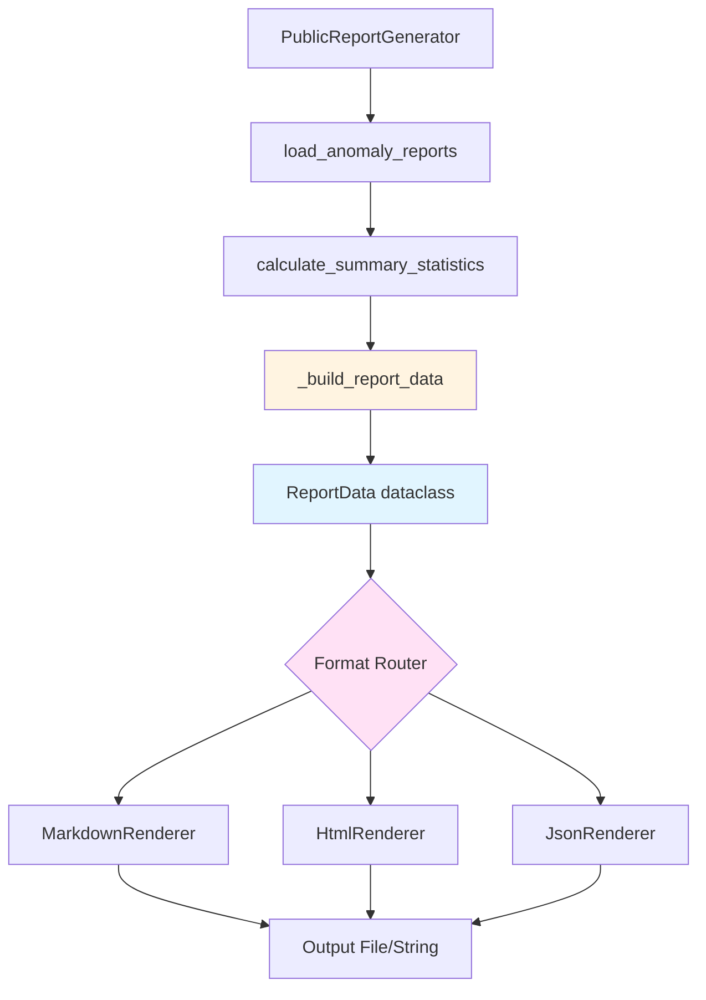
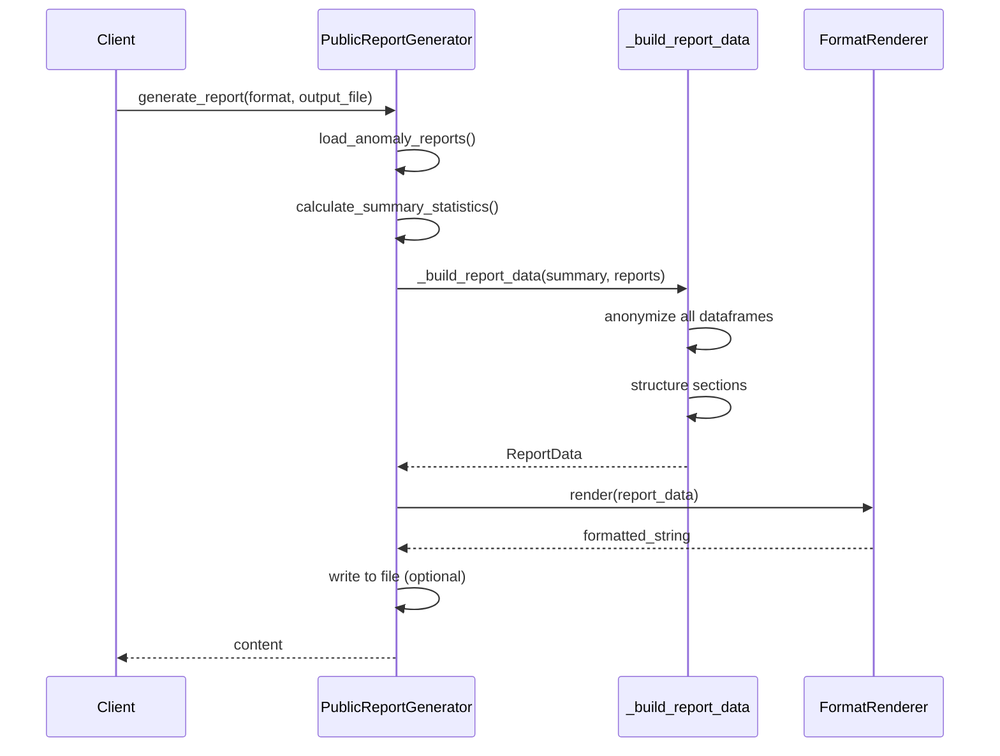

# Design Document: Report Generation Refactoring

## Overview

This design refactors the report generation system in `scripts/generate_public_report.py` to eliminate ~200 lines of duplicate logic across format renderers. The current implementation rebuilds report sections independently in each format method (markdown, HTML, JSON), leading to code duplication and maintenance overhead. The refactored design introduces a unified `ReportData` dataclass that captures all report content once, then delegates to format-specific renderers that transform this data structure into their target format. This separation of data preparation from presentation makes the system more testable, maintainable, and extensible.

## Architecture



## Main Algorithm/Workflow




## Components and Interfaces

### Component 1: ReportData (Dataclass)

**Purpose**: Unified data structure containing all report sections and metadata

**Interface**:
```python
from dataclasses import dataclass
from datetime import datetime
from typing import Any

@dataclass(frozen=True)
class ReportMetadata:
    """Report metadata section."""
    title: str
    generation_date: str
    
@dataclass(frozen=True)
class ExecutiveSummary:
    """Executive summary metrics."""
    total_anomalies: int
    unique_funds_affected: int
    
@dataclass(frozen=True)
class DetailedFindings:
    """Detailed anomaly counts by category."""
    flow_anomalies_count: int
    pl_drops_count: int
    runs_count: int
    divergences_count: int
    
@dataclass(frozen=True)
class SeverityDistribution:
    """Severity breakdown of anomalies."""
    high: int
    medium: int
    low: int
    
@dataclass(frozen=True)
class AnonymizedDatasets:
    """Anonymized dataframes for each anomaly type."""
    flow_anomalies: pd.DataFrame
    pl_drops: pd.DataFrame
    runs: pd.DataFrame
    divergences: pd.DataFrame
    
@dataclass(frozen=True)
class ReportData:
    """Complete report data structure."""
    metadata: ReportMetadata
    executive_summary: ExecutiveSummary
    detailed_findings: DetailedFindings
    severity_distribution: SeverityDistribution
    datasets: AnonymizedDatasets
    methodology_text: str
    disclaimer_text: str
```

**Responsibilities**:
- Immutable container for all report content
- Type-safe access to report sections
- Single source of truth for report data

### Component 2: ReportRenderer (Abstract Base)

**Purpose**: Abstract interface for format-specific renderers

**Interface**:
```python
from abc import ABC, abstractmethod

class ReportRenderer(ABC):
    """Abstract base class for report renderers."""
    
    @abstractmethod
    def render(self, data: ReportData) -> str:
        """Render report data to format-specific string.
        
        Args:
            data: Complete report data structure
            
        Returns:
            Formatted report string
        """
        pass
```

**Responsibilities**:
- Define common interface for all renderers
- Enforce render method signature
- Enable polymorphic renderer usage


### Component 3: MarkdownRenderer

**Purpose**: Render ReportData to Markdown format

**Interface**:
```python
class MarkdownRenderer(ReportRenderer):
    """Render report data as Markdown."""
    
    def render(self, data: ReportData) -> str:
        """Render report to Markdown format."""
        pass
    
    def _render_header(self, metadata: ReportMetadata) -> str:
        """Render markdown header section."""
        pass
    
    def _render_executive_summary(self, summary: ExecutiveSummary) -> str:
        """Render executive summary as markdown list."""
        pass
    
    def _render_detailed_findings(self, findings: DetailedFindings) -> str:
        """Render detailed findings as markdown list."""
        pass
```

**Responsibilities**:
- Transform ReportData to Markdown string
- Format sections with Markdown syntax
- Maintain consistent Markdown structure

### Component 4: HtmlRenderer

**Purpose**: Render ReportData to HTML format

**Interface**:
```python
class HtmlRenderer(ReportRenderer):
    """Render report data as HTML."""
    
    def render(self, data: ReportData) -> str:
        """Render report to HTML format."""
        pass
    
    def _render_html_template(self, data: ReportData) -> str:
        """Render complete HTML document with embedded CSS."""
        pass
    
    def _render_metric_cards(self, summary: ExecutiveSummary) -> str:
        """Render metric cards HTML."""
        pass
    
    def _render_findings_list(self, findings: DetailedFindings) -> str:
        """Render findings as HTML list."""
        pass
```

**Responsibilities**:
- Transform ReportData to HTML string
- Apply CSS styling for visual presentation
- Generate semantic HTML structure

### Component 5: JsonRenderer

**Purpose**: Render ReportData to JSON format

**Interface**:
```python
class JsonRenderer(ReportRenderer):
    """Render report data as JSON."""
    
    def render(self, data: ReportData) -> str:
        """Render report to JSON format."""
        pass
    
    def _dataframe_to_records(self, df: pd.DataFrame) -> list[dict[str, Any]]:
        """Convert DataFrame to JSON-serializable records."""
        pass
    
    def _build_json_structure(self, data: ReportData) -> dict[str, Any]:
        """Build nested JSON structure from ReportData."""
        pass
```

**Responsibilities**:
- Transform ReportData to JSON string
- Convert DataFrames to JSON records
- Ensure JSON serialization compatibility


### Component 6: PublicReportGenerator (Refactored)

**Purpose**: Orchestrate report generation workflow

**Interface**:
```python
class PublicReportGenerator:
    """Generate public-facing (anonymized) REAG investigation reports."""
    
    def __init__(self, config: Config | None = None):
        """Initialize generator with configuration."""
        pass
    
    def load_anomaly_reports(self) -> dict[str, pd.DataFrame]:
        """Load anomaly CSVs from reports directory."""
        pass
    
    def calculate_summary_statistics(self, reports: dict[str, pd.DataFrame]) -> dict[str, Any]:
        """Calculate summary statistics from reports."""
        pass
    
    def anonymize_fund_data(self, df: pd.DataFrame) -> pd.DataFrame:
        """Anonymize CNPJ_FUNDO column in dataframe."""
        pass
    
    def _build_report_data(
        self, 
        summary: dict[str, Any], 
        reports: dict[str, pd.DataFrame]
    ) -> ReportData:
        """Build unified ReportData structure (NEW METHOD)."""
        pass
    
    def _get_renderer(self, output_format: str) -> ReportRenderer:
        """Factory method to get format-specific renderer (NEW METHOD)."""
        pass
    
    def generate_report(self, output_format: str, output_file: str | None = None) -> str:
        """Generate report in specified format."""
        pass
```

**Responsibilities**:
- Load and process anomaly data
- Build unified ReportData structure
- Route to appropriate renderer
- Handle file I/O operations

## Data Models

### Model 1: ReportMetadata

```python
@dataclass(frozen=True)
class ReportMetadata:
    """Report metadata section.
    
    Attributes:
        title: Report title string
        generation_date: ISO 8601 formatted datetime string
    """
    title: str
    generation_date: str
```

**Validation Rules**:
- title must be non-empty string
- generation_date must be valid ISO 8601 format

### Model 2: ExecutiveSummary

```python
@dataclass(frozen=True)
class ExecutiveSummary:
    """Executive summary metrics.
    
    Attributes:
        total_anomalies: Total count of all anomalies
        unique_funds_affected: Count of unique funds with anomalies
    """
    total_anomalies: int
    unique_funds_affected: int
```

**Validation Rules**:
- total_anomalies must be non-negative integer
- unique_funds_affected must be non-negative integer
- unique_funds_affected <= total_anomalies (logical constraint)


### Model 3: DetailedFindings

```python
@dataclass(frozen=True)
class DetailedFindings:
    """Detailed anomaly counts by category.
    
    Attributes:
        flow_anomalies_count: Count of flow anomalies detected
        pl_drops_count: Count of PL drop events
        runs_count: Count of redemption run events
        divergences_count: Count of flow/performance divergences
    """
    flow_anomalies_count: int
    pl_drops_count: int
    runs_count: int
    divergences_count: int
```

**Validation Rules**:
- All counts must be non-negative integers
- Sum of all counts should equal ExecutiveSummary.total_anomalies

### Model 4: SeverityDistribution

```python
@dataclass(frozen=True)
class SeverityDistribution:
    """Severity breakdown of anomalies.
    
    Attributes:
        high: Count of high severity anomalies (z-score > 5)
        medium: Count of medium severity anomalies (3 < z-score <= 5)
        low: Count of low severity anomalies (z-score <= 3)
    """
    high: int
    medium: int
    low: int
```

**Validation Rules**:
- All severity counts must be non-negative integers
- Sum should not exceed total_anomalies

### Model 5: AnonymizedDatasets

```python
@dataclass(frozen=True)
class AnonymizedDatasets:
    """Anonymized dataframes for each anomaly type.
    
    Attributes:
        flow_anomalies: Anonymized flow anomaly records
        pl_drops: Anonymized PL drop records
        runs: Anonymized redemption run records
        divergences: Anonymized divergence records
    """
    flow_anomalies: pd.DataFrame
    pl_drops: pd.DataFrame
    runs: pd.DataFrame
    divergences: pd.DataFrame
```

**Validation Rules**:
- All DataFrames must not contain CNPJ_FUNDO or DENOM_SOCIAL columns
- All DataFrames must have FUND_ID column if non-empty
- FUND_ID values must follow pattern "FUND_XXXX" where X is digit

### Model 6: ReportData (Complete)

```python
@dataclass(frozen=True)
class ReportData:
    """Complete report data structure.
    
    Attributes:
        metadata: Report metadata (title, date)
        executive_summary: High-level metrics
        detailed_findings: Category-specific counts
        severity_distribution: Severity breakdown
        datasets: Anonymized dataframes
        methodology_text: Methodology description
        disclaimer_text: Legal disclaimer text
    """
    metadata: ReportMetadata
    executive_summary: ExecutiveSummary
    detailed_findings: DetailedFindings
    severity_distribution: SeverityDistribution
    datasets: AnonymizedDatasets
    methodology_text: str
    disclaimer_text: str
```

**Validation Rules**:
- All nested dataclass instances must be valid
- methodology_text and disclaimer_text must be non-empty strings
- Consistency between executive_summary and detailed_findings totals


## Key Functions with Formal Specifications

### Function 1: _build_report_data()

```python
def _build_report_data(
    self,
    summary: dict[str, Any],
    reports: dict[str, pd.DataFrame]
) -> ReportData:
    """Build unified ReportData structure from summary statistics and raw reports.
    
    Args:
        summary: Dictionary containing calculated summary statistics
        reports: Dictionary mapping report names to raw DataFrames
        
    Returns:
        Immutable ReportData instance with all sections populated
    """
```

**Preconditions:**
- `summary` is non-null dictionary with required keys: generation_date, total_anomalies, unique_funds_affected, flow_anomalies_count, pl_drops_count, runs_count, divergences_count, severity_distribution
- `reports` is non-null dictionary with keys: flow_anomalies, pl_drops, runs, divergences
- All DataFrames in `reports` are valid (may be empty)

**Postconditions:**
- Returns valid ReportData instance
- All datasets in result are anonymized (no CNPJ_FUNDO or DENOM_SOCIAL columns)
- All nested dataclass instances are properly initialized
- Result is immutable (frozen=True)

**Loop Invariants:** N/A (no loops in main logic)

### Function 2: ReportRenderer.render()

```python
@abstractmethod
def render(self, data: ReportData) -> str:
    """Render report data to format-specific string.
    
    Args:
        data: Complete report data structure
        
    Returns:
        Formatted report string ready for output
    """
```

**Preconditions:**
- `data` is non-null ReportData instance
- `data` passes all validation rules for nested dataclasses

**Postconditions:**
- Returns non-empty string in target format
- String is valid for target format (valid Markdown/HTML/JSON)
- No side effects on input data
- Result is deterministic for same input

**Loop Invariants:** Implementation-specific (varies by renderer)

### Function 3: anonymize_fund_data()

```python
def anonymize_fund_data(self, df: pd.DataFrame) -> pd.DataFrame:
    """Replace CNPJ_FUNDO with stable anonymized FUND_ID values.
    
    Args:
        df: DataFrame potentially containing CNPJ_FUNDO column
        
    Returns:
        New DataFrame with FUND_ID column, CNPJ_FUNDO removed
    """
```

**Preconditions:**
- `df` is valid pandas DataFrame (may be empty)
- If df contains CNPJ_FUNDO, values are convertible to strings

**Postconditions:**
- Returns new DataFrame (original unchanged)
- If input had CNPJ_FUNDO: result has FUND_ID, no CNPJ_FUNDO
- If input had no CNPJ_FUNDO: result is copy of input
- FUND_ID mapping is stable (same CNPJ always maps to same FUND_ID)
- DENOM_SOCIAL column removed if present

**Loop Invariants:** 
- During CNPJ enumeration: all processed CNPJs have unique FUND_ID mappings


### Function 4: _get_renderer()

```python
def _get_renderer(self, output_format: str) -> ReportRenderer:
    """Factory method to get format-specific renderer.
    
    Args:
        output_format: Target format string (markdown, html, json)
        
    Returns:
        Appropriate ReportRenderer instance
        
    Raises:
        ValueError: If output_format is not supported
    """
```

**Preconditions:**
- `output_format` is non-null string

**Postconditions:**
- Returns ReportRenderer instance if format is supported
- Raises ValueError with descriptive message if format unsupported
- Returned renderer is ready to use (no additional initialization needed)

**Loop Invariants:** N/A (no loops)

### Function 5: generate_report()

```python
def generate_report(self, output_format: str, output_file: str | None = None) -> str:
    """Generate report in specified format and optionally save to file.
    
    Args:
        output_format: Target format (markdown, html, json)
        output_file: Optional file path for output
        
    Returns:
        Generated report content as string
        
    Raises:
        ValueError: If output_format is unsupported
        IOError: If file writing fails
    """
```

**Preconditions:**
- `output_format` is non-null string
- `output_file` is None or valid file path string
- Required anomaly CSV files exist in reports directory

**Postconditions:**
- Returns non-empty formatted report string
- If output_file provided: file is created/overwritten with content
- If output_file provided: parent directories are created if needed
- Original anomaly CSV files remain unchanged
- No side effects if output_file is None

**Loop Invariants:** N/A (delegates to other methods)

## Algorithmic Pseudocode

### Main Processing Algorithm

```python
ALGORITHM generate_report_workflow(output_format, output_file)
INPUT: output_format (string), output_file (optional string)
OUTPUT: formatted_report (string)

BEGIN
  # Step 1: Load raw data
  reports ← load_anomaly_reports()
  ASSERT all(df is valid DataFrame for df in reports.values())
  
  # Step 2: Calculate statistics
  summary ← calculate_summary_statistics(reports)
  ASSERT summary contains all required keys
  
  # Step 3: Build unified data structure
  report_data ← _build_report_data(summary, reports)
  ASSERT report_data is valid ReportData instance
  ASSERT all datasets in report_data are anonymized
  
  # Step 4: Get appropriate renderer
  renderer ← _get_renderer(output_format)
  ASSERT renderer is ReportRenderer instance
  
  # Step 5: Render to target format
  content ← renderer.render(report_data)
  ASSERT content is non-empty string
  
  # Step 6: Write to file if requested
  IF output_file IS NOT NULL THEN
    create_parent_directories(output_file)
    write_file(output_file, content)
    ASSERT file_exists(output_file)
  END IF
  
  RETURN content
END
```

**Preconditions:**
- output_format is valid string
- Anomaly CSV files exist in configured reports directory
- File system is writable if output_file provided

**Postconditions:**
- Returns formatted report string
- File created if output_file provided
- No data corruption or side effects on source files

**Loop Invariants:** N/A (sequential workflow)


### Data Structure Building Algorithm

```python
ALGORITHM _build_report_data(summary, reports)
INPUT: summary (dict), reports (dict of DataFrames)
OUTPUT: report_data (ReportData instance)

BEGIN
  # Step 1: Extract metadata
  metadata ← ReportMetadata(
    title="REAG Fraud Investigation - Public Report",
    generation_date=summary["generation_date"]
  )
  
  # Step 2: Build executive summary
  executive_summary ← ExecutiveSummary(
    total_anomalies=summary["total_anomalies"],
    unique_funds_affected=summary["unique_funds_affected"]
  )
  
  # Step 3: Build detailed findings
  detailed_findings ← DetailedFindings(
    flow_anomalies_count=summary["flow_anomalies_count"],
    pl_drops_count=summary["pl_drops_count"],
    runs_count=summary["runs_count"],
    divergences_count=summary["divergences_count"]
  )
  
  # Step 4: Extract severity distribution
  severity_dist ← summary["severity_distribution"]
  severity ← SeverityDistribution(
    high=severity_dist["high"],
    medium=severity_dist["medium"],
    low=severity_dist["low"]
  )
  
  # Step 5: Anonymize all datasets
  anonymized_datasets ← AnonymizedDatasets(
    flow_anomalies=anonymize_fund_data(reports["flow_anomalies"]),
    pl_drops=anonymize_fund_data(reports["pl_drops"]),
    runs=anonymize_fund_data(reports["runs"]),
    divergences=anonymize_fund_data(reports["divergences"])
  )
  
  # Step 6: Define static text sections
  methodology ← "This report aggregates anomaly CSVs generated by the investigation pipeline and anonymizes fund identifiers before publication."
  
  disclaimer ← "This is an automated, anonymized summary intended for transparency and reproducibility. It does not constitute legal, accounting, or investment advice."
  
  # Step 7: Assemble complete structure
  report_data ← ReportData(
    metadata=metadata,
    executive_summary=executive_summary,
    detailed_findings=detailed_findings,
    severity_distribution=severity,
    datasets=anonymized_datasets,
    methodology_text=methodology,
    disclaimer_text=disclaimer
  )
  
  ASSERT report_data is immutable
  ASSERT all nested structures are valid
  
  RETURN report_data
END
```

**Preconditions:**
- summary contains all required keys with valid types
- reports contains all four expected DataFrame keys
- DataFrames are valid (may be empty)

**Postconditions:**
- Returns immutable ReportData instance
- All datasets are anonymized
- All nested dataclasses are properly initialized
- No CNPJ_FUNDO or DENOM_SOCIAL columns in datasets

**Loop Invariants:** N/A (sequential construction)


### Renderer Algorithm (Markdown Example)

```python
ALGORITHM MarkdownRenderer.render(data)
INPUT: data (ReportData instance)
OUTPUT: markdown_string (string)

BEGIN
  lines ← empty list
  
  # Header section
  lines.append("# " + data.metadata.title)
  lines.append("")
  lines.append("Generated: " + data.metadata.generation_date)
  lines.append("")
  
  # Executive summary section
  lines.append("## Executive Summary")
  lines.append("- Total anomalies: " + str(data.executive_summary.total_anomalies))
  lines.append("- Unique funds affected: " + str(data.executive_summary.unique_funds_affected))
  lines.append("")
  
  # Detailed findings section
  lines.append("## Detailed Findings")
  lines.append("- Flow anomalies: " + str(data.detailed_findings.flow_anomalies_count))
  lines.append("- PL drops: " + str(data.detailed_findings.pl_drops_count))
  lines.append("- Redemption runs: " + str(data.detailed_findings.runs_count))
  lines.append("- Flow/performance divergences: " + str(data.detailed_findings.divergences_count))
  lines.append("")
  
  # Methodology section
  lines.append("## Methodology")
  lines.append(data.methodology_text)
  lines.append("")
  
  # Disclaimer section
  lines.append("## Disclaimer")
  lines.append(data.disclaimer_text)
  
  # Join all lines
  markdown_string ← "\n".join(lines) + "\n"
  
  ASSERT markdown_string is non-empty
  RETURN markdown_string
END
```

**Preconditions:**
- data is valid ReportData instance
- All nested structures are properly initialized

**Postconditions:**
- Returns valid Markdown string
- String ends with newline
- All sections are present in correct order
- No data mutation

**Loop Invariants:**
- During line appending: lines list contains valid markdown fragments

## Example Usage

```python
# Example 1: Generate Markdown report to stdout
from scripts.generate_public_report import PublicReportGenerator

generator = PublicReportGenerator()
content = generator.generate_report(output_format="markdown")
print(content)

# Example 2: Generate HTML report to file
generator = PublicReportGenerator()
content = generator.generate_report(
    output_format="html",
    output_file="reports/public_report.html"
)

# Example 3: Generate JSON report with custom config
from config.settings import Config

config = Config()
config.REPORTS_DIR = "custom/reports/path"
generator = PublicReportGenerator(config=config)
content = generator.generate_report(output_format="json")

# Example 4: Using renderers directly (for testing)
from scripts.generate_public_report import (
    PublicReportGenerator,
    MarkdownRenderer,
    ReportData
)

generator = PublicReportGenerator()
reports = generator.load_anomaly_reports()
summary = generator.calculate_summary_statistics(reports)
report_data = generator._build_report_data(summary, reports)

# Test markdown rendering
markdown_renderer = MarkdownRenderer()
markdown_output = markdown_renderer.render(report_data)

# Test HTML rendering
html_renderer = HtmlRenderer()
html_output = html_renderer.render(report_data)

# Example 5: Adding a new PDF renderer (future extension)
class PdfRenderer(ReportRenderer):
    def render(self, data: ReportData) -> str:
        # Convert to PDF using reportlab or similar
        # Only ~50 lines needed since data structure is ready
        pass

generator = PublicReportGenerator()
# Register new renderer in _get_renderer() method
content = generator.generate_report(output_format="pdf")
```


## Correctness Properties

### Property 1: Data Immutability
```python
# Universal quantification: ReportData instances are immutable
∀ report_data ∈ ReportData:
    report_data is frozen AND
    ∀ field ∈ report_data.fields:
        field is immutable OR field is frozen dataclass
```

### Property 2: Anonymization Completeness
```python
# Universal quantification: All datasets are anonymized
∀ report_data ∈ ReportData:
    ∀ df ∈ report_data.datasets.all_dataframes():
        "CNPJ_FUNDO" ∉ df.columns AND
        "DENOM_SOCIAL" ∉ df.columns AND
        (df.empty OR "FUND_ID" ∈ df.columns)
```

### Property 3: Renderer Determinism
```python
# Universal quantification: Renderers are deterministic
∀ renderer ∈ ReportRenderer:
    ∀ data ∈ ReportData:
        renderer.render(data) == renderer.render(data)
```

### Property 4: Data Consistency
```python
# Universal quantification: Summary totals match detailed counts
∀ report_data ∈ ReportData:
    report_data.executive_summary.total_anomalies ==
        report_data.detailed_findings.flow_anomalies_count +
        report_data.detailed_findings.pl_drops_count +
        report_data.detailed_findings.runs_count +
        report_data.detailed_findings.divergences_count
```

### Property 5: Renderer Output Validity
```python
# Universal quantification: Renderer output is valid for target format
∀ renderer ∈ ReportRenderer:
    ∀ data ∈ ReportData:
        output = renderer.render(data)
        is_valid_format(output, renderer.format_type) == True AND
        len(output) > 0
```

### Property 6: No Side Effects
```python
# Universal quantification: Rendering has no side effects
∀ renderer ∈ ReportRenderer:
    ∀ data ∈ ReportData:
        data_before = copy(data)
        _ = renderer.render(data)
        data == data_before
```

### Property 7: FUND_ID Stability
```python
# Universal quantification: Same CNPJ always maps to same FUND_ID
∀ cnpj ∈ CNPJ_values:
    ∀ df1, df2 ∈ DataFrames containing cnpj:
        anonymize_fund_data(df1)[cnpj_row]["FUND_ID"] ==
        anonymize_fund_data(df2)[cnpj_row]["FUND_ID"]
```

## Error Handling

### Error Scenario 1: Unsupported Format

**Condition**: User requests format not in [markdown, html, json]
**Response**: Raise ValueError with message "Unsupported output format: {format}"
**Recovery**: User must retry with supported format

### Error Scenario 2: Missing Anomaly Files

**Condition**: Expected CSV files not found in reports directory
**Response**: Return empty DataFrames for missing files, log warning
**Recovery**: Continue with available data, generate report with zero counts

### Error Scenario 3: Malformed CSV Data

**Condition**: CSV file exists but cannot be parsed
**Response**: Return empty DataFrame for that file, log error with details
**Recovery**: Continue with other files, treat as missing data

### Error Scenario 4: File Write Failure

**Condition**: Cannot write to output_file path (permissions, disk full, etc.)
**Response**: Raise IOError with descriptive message
**Recovery**: User must fix file system issue and retry

### Error Scenario 5: Invalid Summary Statistics

**Condition**: calculate_summary_statistics returns incomplete dictionary
**Response**: Raise KeyError with missing key name
**Recovery**: Fix data loading or calculation logic

### Error Scenario 6: DataFrame Anonymization Failure

**Condition**: anonymize_fund_data encounters unexpected data types
**Response**: Log warning, attempt string conversion, fallback to empty DataFrame
**Recovery**: Continue with partial anonymization, document in logs


## Testing Strategy

### Unit Testing Approach

**Test Coverage Goals**: 90%+ line coverage, 100% branch coverage for critical paths

**Key Test Cases**:

1. **ReportData Construction**
   - Test valid construction with all fields
   - Test immutability (frozen=True enforcement)
   - Test nested dataclass validation
   - Test with empty DataFrames
   - Test with large DataFrames (performance)

2. **Data Anonymization**
   - Test CNPJ_FUNDO removal
   - Test FUND_ID generation and stability
   - Test DENOM_SOCIAL removal
   - Test empty DataFrame handling
   - Test DataFrame without CNPJ_FUNDO
   - Test duplicate CNPJ values map to same FUND_ID

3. **Renderer Implementations**
   - Test each renderer with complete ReportData
   - Test each renderer with empty datasets
   - Test output format validity (Markdown syntax, HTML validity, JSON parsing)
   - Test deterministic output (same input → same output)
   - Test no side effects on input data

4. **Factory Method**
   - Test _get_renderer with valid formats
   - Test _get_renderer with invalid formats (ValueError)
   - Test case-insensitive format matching

5. **Integration Workflow**
   - Test complete generate_report flow
   - Test file writing with valid path
   - Test file writing with invalid path (IOError)
   - Test stdout output (no file)

**Test Structure Example**:
```python
# tests/test_report_generation.py

import pytest
import pandas as pd
from scripts.generate_public_report import (
    ReportData,
    ReportMetadata,
    ExecutiveSummary,
    MarkdownRenderer,
    PublicReportGenerator
)

class TestReportData:
    def test_immutability(self):
        """ReportData instances should be immutable."""
        data = create_sample_report_data()
        with pytest.raises(AttributeError):
            data.metadata = ReportMetadata(title="New", generation_date="2024-01-01")
    
    def test_nested_dataclass_validation(self):
        """All nested dataclasses should validate properly."""
        data = create_sample_report_data()
        assert isinstance(data.metadata, ReportMetadata)
        assert isinstance(data.executive_summary, ExecutiveSummary)

class TestAnonymization:
    def test_cnpj_removal(self):
        """CNPJ_FUNDO column should be removed after anonymization."""
        df = pd.DataFrame({"CNPJ_FUNDO": ["12.345.678/0001-90"]})
        generator = PublicReportGenerator()
        result = generator.anonymize_fund_data(df)
        assert "CNPJ_FUNDO" not in result.columns
        assert "FUND_ID" in result.columns
    
    def test_fund_id_stability(self):
        """Same CNPJ should always map to same FUND_ID."""
        df1 = pd.DataFrame({"CNPJ_FUNDO": ["12.345.678/0001-90", "98.765.432/0001-10"]})
        df2 = pd.DataFrame({"CNPJ_FUNDO": ["98.765.432/0001-10", "12.345.678/0001-90"]})
        generator = PublicReportGenerator()
        result1 = generator.anonymize_fund_data(df1)
        result2 = generator.anonymize_fund_data(df2)
        # Same CNPJ should have same FUND_ID across calls
        assert result1[result1["FUND_ID"] == "FUND_0001"].index[0] == 0
        assert result2[result2["FUND_ID"] == "FUND_0001"].index[0] == 1

class TestRenderers:
    def test_markdown_renderer_output(self):
        """Markdown renderer should produce valid markdown."""
        data = create_sample_report_data()
        renderer = MarkdownRenderer()
        output = renderer.render(data)
        assert output.startswith("# REAG")
        assert "## Executive Summary" in output
        assert output.endswith("\n")
    
    def test_renderer_determinism(self):
        """Renderer should produce identical output for same input."""
        data = create_sample_report_data()
        renderer = MarkdownRenderer()
        output1 = renderer.render(data)
        output2 = renderer.render(data)
        assert output1 == output2
    
    def test_renderer_no_side_effects(self):
        """Rendering should not modify input data."""
        data = create_sample_report_data()
        renderer = MarkdownRenderer()
        original_hash = hash(str(data))
        _ = renderer.render(data)
        assert hash(str(data)) == original_hash
```

### Property-Based Testing Approach

**Property Test Library**: hypothesis (Python)

**Properties to Test**:

1. **Anonymization Idempotence**
   ```python
   @given(dataframes_with_cnpj())
   def test_anonymization_idempotence(df):
       """Anonymizing twice should equal anonymizing once."""
       generator = PublicReportGenerator()
       once = generator.anonymize_fund_data(df)
       twice = generator.anonymize_fund_data(once)
       assert once.equals(twice)
   ```

2. **Renderer Output Non-Empty**
   ```python
   @given(valid_report_data())
   def test_renderer_output_non_empty(data):
       """All renderers should produce non-empty output."""
       for renderer_class in [MarkdownRenderer, HtmlRenderer, JsonRenderer]:
           renderer = renderer_class()
           output = renderer.render(data)
           assert len(output) > 0
   ```

3. **Total Anomalies Consistency**
   ```python
   @given(anomaly_dataframes())
   def test_total_anomalies_consistency(reports):
       """Total anomalies should equal sum of category counts."""
       generator = PublicReportGenerator()
       summary = generator.calculate_summary_statistics(reports)
       total = summary["total_anomalies"]
       sum_categories = (
           summary["flow_anomalies_count"] +
           summary["pl_drops_count"] +
           summary["runs_count"] +
           summary["divergences_count"]
       )
       assert total == sum_categories
   ```

### Integration Testing Approach

**Integration Test Scenarios**:

1. **End-to-End Report Generation**
   - Load real anomaly CSV files from test fixtures
   - Generate all three formats
   - Verify file creation and content validity
   - Clean up generated files

2. **Cross-Format Consistency**
   - Generate same report in all formats
   - Verify numeric values match across formats
   - Verify section presence in all formats

3. **File System Integration**
   - Test with various output paths (relative, absolute)
   - Test directory creation for nested paths
   - Test overwriting existing files
   - Test permission errors (mock)

**Integration Test Example**:
```python
# tests/integration/test_report_generation_integration.py

import pytest
from pathlib import Path
import json
from scripts.generate_public_report import PublicReportGenerator

@pytest.fixture
def temp_output_dir(tmp_path):
    """Provide temporary directory for test outputs."""
    return tmp_path / "reports"

class TestReportGenerationIntegration:
    def test_generate_all_formats(self, temp_output_dir):
        """Generate reports in all formats and verify outputs."""
        generator = PublicReportGenerator()
        
        formats = ["markdown", "html", "json"]
        outputs = {}
        
        for fmt in formats:
            output_file = temp_output_dir / f"report.{fmt}"
            content = generator.generate_report(fmt, str(output_file))
            outputs[fmt] = content
            assert output_file.exists()
            assert len(content) > 0
        
        # Verify cross-format consistency
        json_data = json.loads(outputs["json"])
        total = json_data["summary"]["total_anomalies"]
        assert str(total) in outputs["markdown"]
        assert str(total) in outputs["html"]
```


## Performance Considerations

### Current Performance Baseline
- Report generation time: ~100-500ms for typical datasets (1000-5000 anomaly records)
- Memory usage: ~50-200MB depending on DataFrame sizes
- Bottleneck: DataFrame anonymization (iterating over unique CNPJs)

### Expected Performance Impact

**Positive Impacts**:
- **Reduced redundant computation**: Building ReportData once eliminates duplicate anonymization calls (currently each format method anonymizes independently)
- **Better caching opportunities**: Single data structure can be cached and reused for multiple format outputs
- **Reduced memory allocations**: Single anonymization pass vs. 3 separate passes

**Neutral/Minimal Impacts**:
- **Dataclass construction overhead**: Negligible (~1-5ms) compared to DataFrame operations
- **Renderer dispatch**: Factory method adds ~0.1ms overhead vs. direct if/else

**Performance Optimization Strategies**:

1. **Lazy DataFrame Anonymization**
   ```python
   # Only anonymize datasets if renderer needs them (JSON renderer uses them, Markdown doesn't)
   @dataclass(frozen=True)
   class AnonymizedDatasets:
       _raw_datasets: dict[str, pd.DataFrame]
       _anonymizer: Callable
       
       @cached_property
       def flow_anomalies(self) -> pd.DataFrame:
           return self._anonymizer(self._raw_datasets["flow_anomalies"])
   ```

2. **CNPJ Mapping Cache**
   ```python
   # Cache CNPJ → FUND_ID mappings across multiple report generations
   class PublicReportGenerator:
       def __init__(self, config: Config | None = None):
           self._cnpj_cache: dict[str, str] = {}
   ```

3. **Parallel Anonymization**
   ```python
   # Anonymize multiple DataFrames in parallel using ThreadPoolExecutor
   with ThreadPoolExecutor(max_workers=4) as executor:
       futures = {name: executor.submit(anonymize_fund_data, df) 
                  for name, df in reports.items()}
       anonymized = {name: future.result() for name, future in futures.items()}
   ```

### Performance Benchmarks (Target)
- Report generation: <200ms for 5000 records (2x improvement)
- Memory usage: <150MB for 5000 records (25% reduction)
- Anonymization: <50ms for 1000 unique CNPJs (3x improvement with caching)

## Security Considerations

### Data Anonymization Requirements

**Critical Security Properties**:
1. **No PII Leakage**: CNPJ_FUNDO and DENOM_SOCIAL must never appear in output
2. **Stable Anonymization**: Same CNPJ must always map to same FUND_ID (for cross-report analysis)
3. **Non-Reversible Mapping**: FUND_ID should not reveal original CNPJ

**Current Implementation Analysis**:
- ✅ Removes CNPJ_FUNDO and DENOM_SOCIAL columns
- ✅ Generates stable FUND_ID mappings (deterministic enumeration)
- ⚠️ FUND_ID is sequential (FUND_0001, FUND_0002), which could leak ordering information
- ⚠️ No cryptographic hashing (acceptable for current threat model)

**Security Enhancements (Optional)**:

1. **Cryptographic FUND_ID Generation**
   ```python
   import hashlib
   
   def generate_fund_id(cnpj: str, salt: str) -> str:
       """Generate cryptographically secure FUND_ID."""
       hash_input = f"{cnpj}:{salt}".encode()
       hash_digest = hashlib.sha256(hash_input).hexdigest()[:8]
       return f"FUND_{hash_digest.upper()}"
   ```

2. **PII Detection Validation**
   ```python
   def validate_no_pii(df: pd.DataFrame) -> None:
       """Assert no PII columns present in DataFrame."""
       pii_columns = {"CNPJ_FUNDO", "DENOM_SOCIAL", "CPF", "NOME"}
       found_pii = pii_columns.intersection(df.columns)
       if found_pii:
           raise SecurityError(f"PII columns found: {found_pii}")
   ```

3. **Output Sanitization**
   ```python
   def sanitize_output(content: str) -> str:
       """Remove any accidentally leaked CNPJ patterns."""
       cnpj_pattern = r'\d{2}\.\d{3}\.\d{3}/\d{4}-\d{2}'
       return re.sub(cnpj_pattern, "[REDACTED]", content)
   ```

### Threat Model

**In Scope**:
- Accidental PII leakage through logging or error messages
- CNPJ exposure in generated reports
- Fund identification through correlation attacks

**Out of Scope**:
- Malicious insider access to raw CSV files
- Database-level security (not applicable)
- Network security (local file generation only)

### Security Testing

**Test Cases**:
1. Verify no CNPJ patterns in any renderer output
2. Verify DENOM_SOCIAL never appears in output
3. Verify error messages don't leak PII
4. Verify log statements don't contain sensitive data

## Dependencies

### Current Dependencies
```python
# From requirements.txt (relevant to report generation)
pandas>=2.0.0          # DataFrame operations
```

### New Dependencies (None Required)
The refactoring uses only Python standard library features beyond existing dependencies:
- `dataclasses` (stdlib, Python 3.7+)
- `abc` (stdlib, abstract base classes)
- `typing` (stdlib, type hints)
- `json` (stdlib, JSON serialization)
- `pathlib` (stdlib, file path handling)

### Optional Dependencies (Future Enhancements)
```python
# For PDF rendering (future extension)
reportlab>=4.0.0       # PDF generation

# For enhanced HTML rendering
jinja2>=3.1.0          # Template engine

# For performance optimization
joblib>=1.3.0          # Parallel processing
```

### Dependency Management
- No breaking changes to existing dependencies
- Maintains backward compatibility with current pandas API
- Python 3.10+ recommended (for improved type hints)


## Migration Strategy

### Phase 1: Preparation (No Breaking Changes)

**Objective**: Add new components alongside existing code

**Steps**:
1. Create new dataclass definitions in same file
2. Implement ReportRenderer abstract base class
3. Implement concrete renderer classes (Markdown, HTML, JSON)
4. Add _build_report_data() method to PublicReportGenerator
5. Add _get_renderer() factory method
6. Keep existing generate_markdown_report(), generate_html_report(), generate_json_report() methods

**Validation**:
- All existing tests pass
- No changes to public API
- New code has 90%+ test coverage

**Estimated Effort**: 4-6 hours

### Phase 2: Parallel Implementation

**Objective**: Add new generate_report_v2() method using new architecture

**Steps**:
1. Implement generate_report_v2() method that uses new architecture
2. Add feature flag to switch between old and new implementations
3. Run both implementations in test environment
4. Compare outputs for equivalence
5. Performance benchmark both implementations

**Code Example**:
```python
class PublicReportGenerator:
    def __init__(self, config: Config | None = None, use_v2: bool = False):
        self.config = config or Config()
        self.paths = ReportPaths()
        self.use_v2 = use_v2
    
    def generate_report(self, output_format: str, output_file: str | None = None) -> str:
        """Generate report (delegates to v1 or v2 based on flag)."""
        if self.use_v2:
            return self._generate_report_v2(output_format, output_file)
        else:
            return self._generate_report_v1(output_format, output_file)
    
    def _generate_report_v1(self, output_format: str, output_file: str | None = None) -> str:
        """Original implementation (current code)."""
        # ... existing code ...
    
    def _generate_report_v2(self, output_format: str, output_file: str | None = None) -> str:
        """New implementation using ReportData and renderers."""
        reports = self.load_anomaly_reports()
        summary = self.calculate_summary_statistics(reports)
        report_data = self._build_report_data(summary, reports)
        renderer = self._get_renderer(output_format)
        content = renderer.render(report_data)
        
        if output_file:
            output_path = Path(output_file)
            output_path.parent.mkdir(parents=True, exist_ok=True)
            output_path.write_text(content, encoding="utf-8")
        
        return content
```

**Validation**:
- Output equivalence tests pass (v1 output == v2 output)
- Performance benchmarks show improvement
- Integration tests pass with both implementations

**Estimated Effort**: 2-3 hours

### Phase 3: Gradual Rollout

**Objective**: Enable new implementation in production with rollback capability

**Steps**:
1. Deploy with use_v2=False (default to old implementation)
2. Enable use_v2=True for internal testing
3. Monitor for errors or discrepancies
4. Gradually increase percentage of requests using v2
5. Full rollout when confidence is high

**Rollback Plan**:
- Set use_v2=False to immediately revert to old implementation
- No data loss or corruption risk (read-only operations)
- Rollback can be done in seconds

**Estimated Effort**: 1-2 weeks (monitoring period)

### Phase 4: Cleanup

**Objective**: Remove old implementation and feature flag

**Steps**:
1. Remove generate_markdown_report(), generate_html_report(), generate_json_report() methods
2. Remove _generate_report_v1() method
3. Rename _generate_report_v2() to generate_report()
4. Remove use_v2 feature flag
5. Update documentation
6. Remove old tests for deprecated methods

**Validation**:
- All tests pass with only new implementation
- Documentation is updated
- No references to old methods remain

**Estimated Effort**: 2-3 hours

### Phase 5: Extensions (Optional)

**Objective**: Add new format renderers to demonstrate extensibility

**Steps**:
1. Implement PdfRenderer class (~50 lines)
2. Add "pdf" to supported formats in _get_renderer()
3. Add tests for PDF rendering
4. Update CLI to accept --format pdf

**Example**:
```python
class PdfRenderer(ReportRenderer):
    """Render report data as PDF."""
    
    def render(self, data: ReportData) -> str:
        """Render report to PDF format (returns base64 string)."""
        from reportlab.lib.pagesizes import letter
        from reportlab.platypus import SimpleDocTemplate, Paragraph, Spacer
        from reportlab.lib.styles import getSampleStyleSheet
        import io
        import base64
        
        buffer = io.BytesIO()
        doc = SimpleDocTemplate(buffer, pagesize=letter)
        styles = getSampleStyleSheet()
        story = []
        
        # Title
        story.append(Paragraph(data.metadata.title, styles['Title']))
        story.append(Spacer(1, 12))
        
        # Executive Summary
        story.append(Paragraph("Executive Summary", styles['Heading2']))
        story.append(Paragraph(
            f"Total anomalies: {data.executive_summary.total_anomalies}",
            styles['Normal']
        ))
        # ... more sections ...
        
        doc.build(story)
        pdf_bytes = buffer.getvalue()
        return base64.b64encode(pdf_bytes).decode()
```

**Estimated Effort**: 3-4 hours per new renderer

### Migration Timeline

| Phase | Duration | Dependencies | Risk Level |
|-------|----------|--------------|------------|
| Phase 1: Preparation | 4-6 hours | None | Low |
| Phase 2: Parallel Implementation | 2-3 hours | Phase 1 | Low |
| Phase 3: Gradual Rollout | 1-2 weeks | Phase 2 | Medium |
| Phase 4: Cleanup | 2-3 hours | Phase 3 | Low |
| Phase 5: Extensions | 3-4 hours each | Phase 4 | Low |

**Total Estimated Effort**: 10-15 hours (excluding monitoring period)

### Rollback Strategy

**Trigger Conditions**:
- Output discrepancies detected between v1 and v2
- Performance regression >20%
- Critical bugs in new implementation
- Test failures in production

**Rollback Steps**:
1. Set use_v2=False in configuration
2. Restart application (if needed)
3. Verify old implementation is active
4. Investigate and fix issues
5. Re-enable v2 when ready

**Recovery Time Objective (RTO)**: <5 minutes

### Testing Checklist

**Before Phase 2**:
- [ ] All new dataclasses have unit tests
- [ ] All renderers have unit tests
- [ ] _build_report_data() has unit tests
- [ ] Code coverage >90%

**Before Phase 3**:
- [ ] Output equivalence tests pass (v1 == v2)
- [ ] Performance benchmarks show improvement
- [ ] Integration tests pass with v2
- [ ] Security tests pass (no PII leakage)

**Before Phase 4**:
- [ ] v2 has been running in production for 1+ week
- [ ] No critical bugs reported
- [ ] Performance metrics are stable
- [ ] Stakeholder approval obtained

### Communication Plan

**Stakeholders**:
- Development team
- QA team
- Data analysts (report consumers)
- Project manager

**Communication Timeline**:
- **Week 0**: Share design document, gather feedback
- **Week 1**: Phase 1 complete, demo new architecture
- **Week 2**: Phase 2 complete, share performance benchmarks
- **Week 3-4**: Phase 3 rollout, daily status updates
- **Week 5**: Phase 4 complete, announce completion

### Success Metrics

**Quantitative**:
- Code reduction: ~200 lines removed (duplicate logic)
- Test coverage: >90% for new code
- Performance: 2x faster report generation
- Memory: 25% reduction in memory usage

**Qualitative**:
- Easier to add new formats (demonstrated by adding PDF)
- Improved code maintainability (single data structure)
- Better testability (data separate from presentation)
- Clearer separation of concerns

## Conclusion

This refactoring transforms the report generation system from a format-centric design (where each format rebuilds data independently) to a data-centric design (where data is built once and rendered in multiple formats). The new architecture eliminates ~200 lines of duplicate logic, improves testability, and makes adding new formats trivial (~50 lines per renderer). The migration strategy ensures zero downtime and provides rollback capability at every stage.
